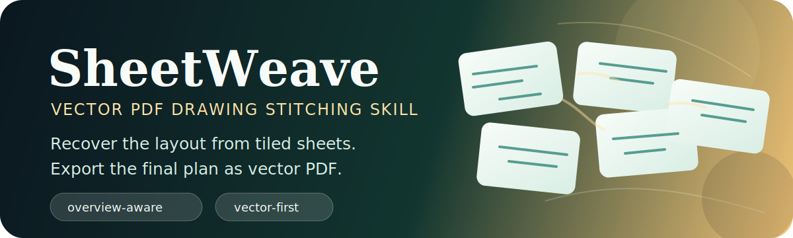
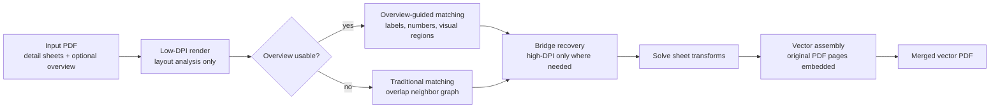

<p align="center">
  
</p>

<p align="center">
  <a href="README.zh-CN.md">简体中文</a> | <a href="README.md">English</a>
</p>

<p align="center">
  <a href="LICENSE"></a>
  
  
  
</p>

<h1 align="center">SheetWeave</h1>

<p align="center">
  Weave tiled drawing sheets into one complete vector PDF.
</p>

---

SheetWeave is an agent skill, not a standalone app you are expected to operate by hand. Give your agent a drawing PDF and ask it to use `$sheetweave`; the skill provides the workflow, scripts, and review checkpoints needed to recover the layout and produce a merged vector PDF.

## What Problem Does It Solve?

Many construction, architecture, and engineering PDFs are split into local/detail sheets. The hard part is not just stitching images together; it is recovering where each sheet belongs while keeping the final drawing sharp and vector-based.

| Your situation | What SheetWeave helps the agent do |
| --- | --- |
| The PDF includes an overview/index page | Use the overview as the layout guide. |
| Overview labels are clear | Match detail pages by sheet codes or numeric markers. |
| Overview labels are weak or missing | Fall back to visual region matching, or ask for manual/VLM mapping. |
| There is no overview page | Use overlap-based neighbor matching between detail sheets. |
| Some sheets connect only through small overlaps | Use targeted bridge recovery instead of slow full high-DPI rendering. |
| The final result must stay vector | Place original PDF pages onto a larger LaTeX/TikZ canvas. |

In one sentence:

> SheetWeave is a drawing-layout recovery skill, not a raster screenshot stitcher.

## Quick Start

### 1. Install the skill into your agent

Recommended:

```bash
npx skills add WorkHaH/SheetWeave
```

Manual install:

```bash
git clone https://github.com/WorkHaH/SheetWeave.git ~/.agents/skills/sheetweave
```

For a project-local skill, place it under:

```text
.agents/skills/sheetweave/
```

Restart or reload your agent after installation so it can discover `SKILL.md`.

### 2. Ask your agent to use it

Typical prompts:

```text
Use $sheetweave to merge this drawing PDF into one vector PDF: ./drawings.pdf
```

```text
用 $sheetweave 处理这个 PDF，把里面的局部图纸拼成一张完整的矢量 PDF。
```

```text
Use $sheetweave on ./drawings.pdf. If the overview matching is ambiguous, prepare a VLM layout request instead of guessing.
```

### 3. Review the result

The agent should inspect `summary.json` and the PNG preview before treating the vector PDF as final.

## How It Works



## What The Agent Produces

```text
output/run/
  summary.json                 # mapping, edges, components, final paths
  final/
    full-merged.pdf            # vector result when one component is solved
    full-merged.tex            # generated LaTeX/TikZ source
    full-merged.png            # raster review preview only
    layout-contact.png         # overview-guided contact sheet when available
  groups/group-XX/             # written when disconnected components remain
  vlm-request.json             # written when overview mapping needs help
```

## Runtime Environment

The skill includes Python scripts because PDF rendering, overlap matching, and vector assembly need deterministic tooling. Your agent may check or install these dependencies when needed.

| Requirement | Purpose |
| --- | --- |
| Python 3.10+ | Runs the bundled scripts. |
| `numpy`, `opencv-python`, `Pillow`, `pypdf` | Image matching and PDF manipulation. |
| `pdfinfo`, `pdftoppm`, `pdftotext` | PDF metadata, preview rendering, text extraction. |
| `pdflatex` | Final vector PDF assembly. |

If you want to prepare the machine manually:

```bash
pip install -r scripts/requirements.txt
```

## Manual / VLM Overview Mapping

When automatic overview matching is ambiguous, SheetWeave writes `vlm-request.json`. The agent should then read [`references/overview_layout_prompt.md`](references/overview_layout_prompt.md), ask a vision model or human to map overview regions to PDF pages, and rerun with `--overview-layout-json`.

This fallback is intentionally review-first: if the overview cannot be matched confidently, the skill should expose uncertainty instead of silently guessing.

## Quality Bar

A good SheetWeave run should:

- Produce a single `final/full-merged.pdf` when the drawing set is connected.
- Keep the final PDF vector-based by embedding original PDF pages.
- Write `summary.json` with enough diagnostics to audit accepted, bridge, and synthetic edges.
- Preserve review artifacts so a human can verify alignment before using the result.
- Degrade gracefully into groups or a VLM request when the layout is not solved.

## Repository Layout

```text
sheetweave/
  SKILL.md                         # skill entry point loaded by agents
  README.md                        # English GitHub documentation
  README.zh-CN.md                  # Chinese GitHub documentation
  agents/openai.yaml               # OpenAI Codex UI metadata
  scripts/
    sheetweave.py                  # main deterministic helper
    merge_drawings.py              # overlap scoring and raster diagnostics
    merge_pdf_drawings.py          # PDF helpers and overview parsing
    vector_pdf_export.py           # vector PDF assembly
    requirements.txt               # Python dependencies
  references/
    overview_layout_prompt.md      # prompt for manual/VLM mapping
```

## Current Limitations

- Very large canvases may hit LaTeX page-size limits depending on the TeX distribution.
- Synthetic bridge edges are geometric inferences; review `summary.json` and `full-merged.png` for critical work.
- The repository intentionally excludes real drawing PDFs and generated outputs. Add only public fixtures with clear licenses.

