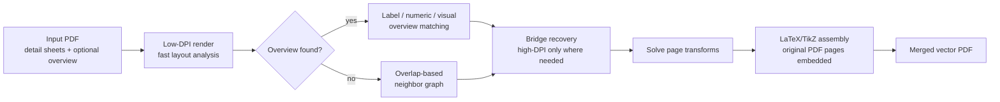

<p align="center">
  
</p>

<p align="center">
  <a href="LICENSE"></a>
  
  
  
</p>

<h1 align="center">SheetWeave</h1>

<p align="center">
  An open-source agent skill for weaving tiled vector drawing PDFs into one complete vector plan.
</p>

---

## Why SheetWeave?

Many construction, architecture, and engineering PDFs are split into local/detail sheets. SheetWeave helps an agent recover how those sheets fit together, then exports the final merged drawing without flattening the source vector content into a raster image.

| Problem | SheetWeave approach |
| --- | --- |
| PDF has an overview/index page | Detect the overview and use labels, numeric markers, or visual regions as layout hints. |
| Overview has weak or missing labels | Fall back to visual matching and optional VLM/manual overview JSON. |
| PDF has no overview page | Use traditional overlap-based neighbor matching. |
| Some pieces only connect through small overlaps | Run selective high-DPI bridge recovery instead of rendering every page at high DPI. |
| Final output must stay editable/sharp | Embed original PDF pages into a larger LaTeX/TikZ vector canvas. |

## Quick Start

```bash
git clone https://github.com/WorkHaH/SheetWeave.git
cd SheetWeave
pip install -r scripts/requirements.txt
python scripts/sheetweave.py --pdf path/to/drawings.pdf --out output/run --mode review
```

You also need these command-line tools in `PATH`:

| Tool | Used for |
| --- | --- |
| `pdfinfo` | Read PDF metadata and page count. |
| `pdftoppm` | Render low-resolution previews for layout recovery. |
| `pdftotext` | Extract overview labels and sheet codes. |
| `pdflatex` | Assemble the final vector PDF canvas. |

## How It Works



## Output Preview

```text
output/run/
  summary.json                 # mapping, edges, components, final paths
  final/
    full-merged.pdf            # vector result when one component is solved
    full-merged.tex            # generated LaTeX/TikZ source
    full-merged.png            # raster review preview only
    layout-contact.png         # overview-guided contact sheet when available
  groups/group-XX/             # written when disconnected components remain
  vlm-request.json             # written when overview mapping needs help
```

## Skill Installation

SheetWeave is a portable agent skill. The minimum useful payload is `SKILL.md` plus the `scripts/` and `references/` folders.

| Agent / setup | Install path example |
| --- | --- |
| OpenAI Codex user skill | `~/.agents/skills/sheetweave/` |
| OpenAI Codex project skill | `.agents/skills/sheetweave/` |
| Claude-style skill folder | `~/.claude/skills/sheetweave/` |
| Generic repository usage | Clone and run `python scripts/sheetweave.py ...` |

## Manual / VLM Overview Mapping

When automatic overview matching is ambiguous, SheetWeave writes `vlm-request.json`. Use [`references/overview_layout_prompt.md`](references/overview_layout_prompt.md) with the overview image and page previews to create a JSON mapping, then rerun:

```bash
python scripts/sheetweave.py \
  --pdf path/to/drawings.pdf \
  --overview-layout-json path/to/overview-layout.json \
  --out output/run-with-layout \
  --mode review
```

## Repository Layout

```text
sheetweave/
  SKILL.md                         # skill entry point loaded by agents
  agents/openai.yaml               # OpenAI Codex UI metadata
  scripts/
    sheetweave.py                  # main CLI
    merge_drawings.py              # overlap scoring and raster diagnostics
    merge_pdf_drawings.py          # legacy PDF helpers and overview parsing
    vector_pdf_export.py           # vector PDF assembly
    requirements.txt               # Python dependencies
  references/
    overview_layout_prompt.md      # prompt for manual/VLM mapping
```

## Current Limitations

- Very large canvases may hit LaTeX page-size limits depending on the TeX distribution.
- Synthetic bridge edges are geometric inferences; review `summary.json` and `full-merged.png` for critical work.
- The repository intentionally excludes real drawing PDFs and generated outputs. Add only public fixtures with clear licenses.

