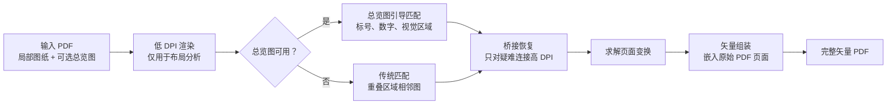

<p align="center">
  
</p>

<p align="center">
  <a href="README.md">English</a> | <a href="README.zh-CN.md">简体中文</a>
</p>

<p align="center">
  <a href="LICENSE"></a>
  
  
  
</p>

<h1 align="center">SheetWeave</h1>

<p align="center">
  把分块图纸 PDF 编织成一张完整的矢量 PDF。
</p>

---

SheetWeave 是一个 agent skill，不是让你手动操作的独立应用。你只需要把图纸 PDF 交给 agent，并要求它使用 `$sheetweave`；skill 会提供图纸布局恢复、脚本工具和结果检查流程，帮助 agent 输出完整的矢量 PDF。

## 它解决什么问题？

很多施工、建筑、工程图纸 PDF 会被拆成多张局部图纸。真正困难的地方不只是把图片贴起来，而是判断每一张局部图纸在整体图纸中的位置，同时让最终结果保持矢量清晰度。

| 你的情况 | SheetWeave 帮 agent 做什么 |
| --- | --- |
| PDF 里有缩略图/总览图 | 把总览图作为布局参考。 |
| 总览图上标号清楚 | 用图纸编号、数字标号匹配局部页面。 |
| 总览图标号弱或没有标号 | 使用视觉区域匹配，必要时生成 VLM/人工映射请求。 |
| PDF 里没有总览图 | 使用传统重叠区域匹配，建立相邻关系图。 |
| 有些图纸只通过很小重叠连接 | 只对疑难连接做高 DPI 桥接恢复，避免全量高 DPI 慢跑。 |
| 最终结果必须是矢量图 | 把原始 PDF 页面放到更大的 LaTeX/TikZ 画布中。 |

一句话：

> SheetWeave 是图纸布局恢复 skill，不是栅格截图拼接器。

## 快速开始

### 1. 安装到你的 agent skill 目录

推荐方式：

```bash
npx skills add WorkHaH/SheetWeave
```

手动安装：

```bash
git clone https://github.com/WorkHaH/SheetWeave.git ~/.agents/skills/sheetweave
```

如果只想在某个项目里使用，也可以放到：

```text
.agents/skills/sheetweave/
```

安装后重启或刷新你的 agent，让它能够发现 `SKILL.md`。

### 2. 直接让 agent 使用它

常见提示词：

```text
用 $sheetweave 处理这个 PDF，把里面的局部图纸拼成一张完整的矢量 PDF：./drawings.pdf
```

```text
Use $sheetweave to merge this drawing PDF into one vector PDF: ./drawings.pdf
```

```text
用 $sheetweave 处理 ./drawings.pdf。如果缩略图匹配不明确，不要猜，先生成 VLM 布局请求。
```

### 3. 检查结果

agent 应该先检查 `summary.json` 和 PNG 预览图，再把矢量 PDF 视为最终结果。

## 工作流程



## Agent 会产出什么？

```text
output/run/
  summary.json                 # 页面映射、边、组件、最终输出路径
  final/
    full-merged.pdf            # 成功合成单组件时的矢量结果
    full-merged.tex            # 生成矢量 PDF 的 LaTeX/TikZ 源文件
    full-merged.png            # 仅用于检查的栅格预览图
    layout-contact.png         # 总览图引导成功时的页面顺序检查图
  groups/group-XX/             # 仍存在多个断开组件时的分组输出
  vlm-request.json             # 总览图映射需要人工/VLM 帮助时生成
```

## 运行环境

这个 skill 包含 Python 脚本，因为 PDF 渲染、重叠匹配和矢量组装需要确定性的工具。agent 可以在需要时检查或安装这些依赖。

| 依赖 | 用途 |
| --- | --- |
| Python 3.10+ | 运行内置脚本。 |
| `numpy`, `opencv-python`, `Pillow`, `pypdf` | 图像匹配和 PDF 操作。 |
| `pdfinfo`, `pdftoppm`, `pdftotext` | PDF 元信息、预览渲染、文本提取。 |
| `pdflatex` | 最终矢量 PDF 组装。 |

如果你想提前手动准备环境：

```bash
pip install -r scripts/requirements.txt
```

## 人工 / VLM 总览图映射

当自动总览图匹配不明确时，SheetWeave 会写出 `vlm-request.json`。agent 应该读取 [`references/overview_layout_prompt.md`](references/overview_layout_prompt.md)，让视觉模型或人工把总览图区域映射到 PDF 页面，然后用 `--overview-layout-json` 重新运行。

这个 fallback 是故意偏审慎的：如果不能高置信匹配，就暴露不确定性，而不是静默猜测。

## 质量标准

一次好的 SheetWeave 运行应该：

- 在图纸集连通时生成单个 `final/full-merged.pdf`。
- 通过嵌入原始 PDF 页面保持最终结果为矢量 PDF。
- 在 `summary.json` 中记录可审计的普通边、桥接边和推断边。
- 保留预览和诊断产物，方便人工确认拼接是否正确。
- 当布局没有解决时，优雅退化为多个分组或 VLM 请求，而不是假装成功。

## 仓库结构

```text
sheetweave/
  SKILL.md                         # agent 加载的 skill 入口
  README.md                        # 英文 GitHub 文档
  README.zh-CN.md                  # 中文 GitHub 文档
  agents/openai.yaml               # OpenAI Codex UI 元数据
  scripts/
    sheetweave.py                  # 主要确定性辅助脚本
    merge_drawings.py              # 重叠评分和栅格诊断
    merge_pdf_drawings.py          # PDF 辅助逻辑和总览图解析
    vector_pdf_export.py           # 矢量 PDF 组装
    requirements.txt               # Python 依赖
  references/
    overview_layout_prompt.md      # 人工/VLM 映射提示词
```

## 当前限制

- 超大画布可能会触发某些 LaTeX 发行版的页面尺寸限制。
- 推断桥接边属于几何推断；关键场景请检查 `summary.json` 和 `full-merged.png`。
- 仓库刻意不包含真实图纸 PDF 和生成结果。如需添加样例，请只添加许可明确的公开素材。

